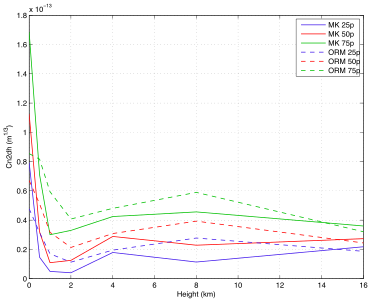
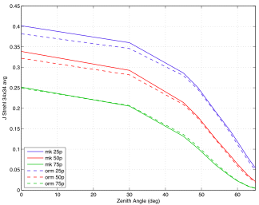
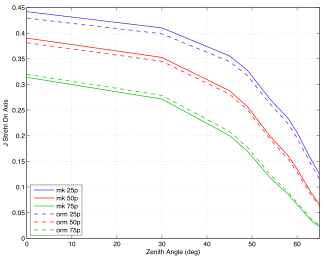
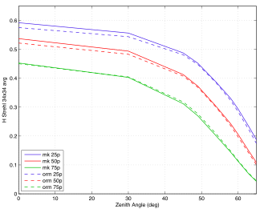
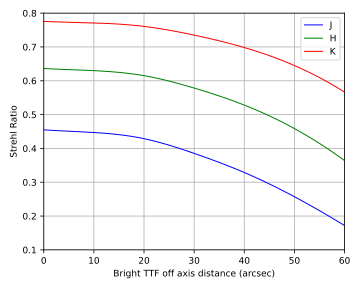

\page page43_nfiraos NFIRAOS Performance

\tableofcontents
# Turbulence profile

- Mauna Kea: based on DIMM/MASS measurements in TMT site testing campaign
- ORM: based on 5-year Scidar measurements at JKT
- Caveat:
	- DIMM/MASS tends to under-estimate free atmosphere seeing
	- Scidar tends to under-estimate ground layer seeing
	- The actual difference might be smaller than measurements.

The following table and figure show comparison of turbulence profile at 25, 50, and 75 percentile seeing

|Percentile |Mauna Kea r0 (m) | ORM r0 (m)|
|----------:|--------------------:|------------------:|
|25p |0.247 |0.230|
|50p |0.186 |0.178|
|75p |0.135 |0.138|

|Turbulence Profile|
|------------------|
||

# AO Performance

The following lists AO system and instrument parameters and the respective AO performance.

## NFIRAOS
- 30 meter TMT aperture
- 2 Deformable Mirrors (DMs) of order 60x60 conjugated to 0 and 11.8 km
- 6 Laser Guide Stars (LGS) wavefront sensor (WFS) on 35" radius pentagon and on axis
- 1 Pyramid WFS 
- 2 arcminute diameter field of view (fov)
- Up to 800 Hz update rate

## IRIS Imager
- 34"x34" square fov
- 3 on instrument wavefront sensor (OIWFS), selectable between tip/tilt and 2x2 subaperture mode
- 4 on detector guide window (ODGW)

MAOS simulations obtained estimation of the fundamental terms. Implementation error of 153 nm (34x34” FoV) and 152 nm (On axis) is added in quadrature to get the estimate of the total WFE.

### Wavefront error

The following figures show the RMS WFE averaged over 34"x34" field of view or on axis.

|Wavefront error||
|:-------------------:|:-------------------:|
| | |

### J band Strehl Ratio

The following figures show the J band Strehl Ratio averaged over 34"x34" field of view or on axis.

|J band Strehl ||
|:-------------------:|:-------------------:|
| | |

### H band Strehl Ratio

The following figures show the H band Strehl Ratio averaged over 34"x34" field of view or on axis.

|H band Strehl||
|:-------------------:|:-------------------:|
| | |

### K band Strehl Ratio

The following figures show the K band Strehl Ratio averaged over 34"x34" field of view or on axis.

|K band Strehl||
|:-------------------:|:-------------------:|
| | |

## MODHIS

- On axis science fov
- Single 2x2 OIWFS (TBD)

MAOS simulations obtained estimation of the fundamental terms. Implementation error of 130 nm is added in quadrature to get the estimate of the total WFE.

The following figures show the wavefront error and Strehl Ratio for median seeing for the on axis field.

|Wavefront error|Strehl Ratio|
|:-------------------:|:-------------------:|
| | |
